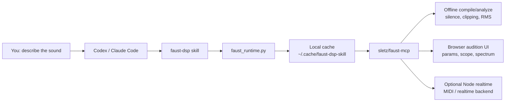
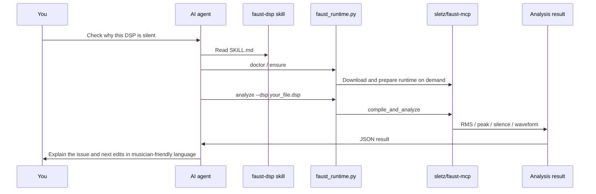
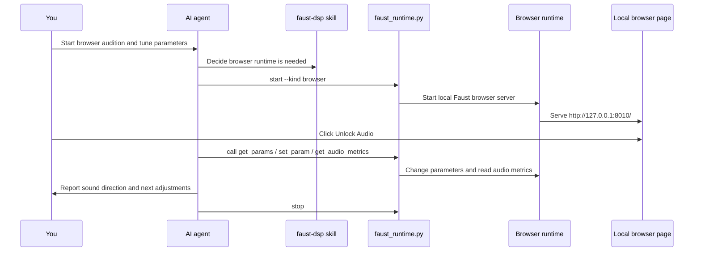

# Faust DSP Skill

Language: English | [中文](README.md)

Use Codex, Claude Code, or another skill-capable AI agent to write, check,
audition, and debug [Faust](https://faust.grame.fr/) DSP audio programs.

> This project is adapted from the runtime design and tool surface of
> [sletz/faust-mcp](https://github.com/sletz/faust-mcp). Thanks to the original
> `sletz/faust-mcp` author and the Faust community for the MCP server, browser
> runtime, Node realtime runtime, and offline analysis ideas. This project wraps
> those capabilities as a skill that is easier for Codex, Claude Code, and other
> AI agents to use.

If you are a musician, sound designer, or electronic music maker, it is fine if
terms like MCP, Python, or Node.js are unfamiliar. The goal of this project is:
you describe the sound, and the AI helps set up, start, use, and shut down the
local Faust test environment as much as possible.

## Check Before Installing

This project is not a VST/AU plug-in and not a standalone music application. It
is a skill for AI agents.

Before installing, you should at least:

1. Have **Codex** or **Claude Code** installed and openable.
2. Know how to type a task in Codex / Claude Code, for example "help me check this project".
3. Know how to approve or deny terminal commands when the AI asks to run them.
4. Be able to open a terminal and paste a few commands.

If you have never used Codex or Claude Code before, learn their basic operation
first, then come back to this skill. This README tries to be friendly, but it
does not start from "what is a terminal".

## What This Skill Helps With

You can tell the AI:

```text
Use $faust-dsp to write a simple warm pad synth in Faust and check whether it outputs sound.
```

After installation, the AI can help you:

- Write Faust `.dsp` synthesizers or effects.
- Check Faust code for syntax errors.
- Analyze whether audio is silent, clipping, or too quiet.
- Start a local browser audition UI.
- Change parameters, read audio levels, inspect scope/spectrum/probe data.
- Install and start the underlying runtime on demand, so you do not have to configure an MCP server manually.

## The Smallest Mental Model

You do not need to install an MCP server manually. You install this skill.



Think of it as three layers:

1. **You talk to the AI**: describe sound goals, paste Faust code, request changes.
2. **The skill teaches the AI what to do**: the AI reads `SKILL.md`, knows which scripts to call, and knows how to explain results.
3. **The local runtime does the work**: `sletz/faust-mcp` compiles, analyzes, plays, and exposes parameters.

## Install: Recommended Codex Flow

The easiest path is to let Codex install it for you.

### Before Installing: Faust CLI Is Required

This skill can download and start the underlying runtime automatically, but the
computer still needs the `faust` command when it is time to compile Faust DSP.

You do not necessarily need to install it by hand. The recommended experience is:
let Codex check first. If `faust` is missing, Codex should explain what it wants
to install and then run the install command only after you approve it.

### Platform Status

This project is currently **macOS-first**: the install instructions, Homebrew
install prompt, and browser playback flow have been tested on macOS.

It is not theoretically limited to macOS. Linux should be able to run basic
offline analysis and runtime flows when `git`, Python 3, `faust`, `g++`, and
Node.js/npm are available, but it has not been tested as thoroughly as macOS.
Linux users should ask the AI to use their distribution package manager for
Faust CLI, not Homebrew.

Native Windows is not currently recommended as the first choice. The launcher
assumes a Unix-like environment in several places, including `venv/bin/python`,
`g++`, process-group cleanup, and shell wrappers. Windows users should try WSL
first.

If you are on macOS, the most common install method is Homebrew:

```bash
brew install faust
```

This can take a few minutes, especially if Homebrew updates itself first. It is
a system-level software install, so it should not run silently.

Open a new Codex conversation and paste this:

```text
Please install Faust DSP Skill:
https://github.com/pingp76/faust-dsp-skill/tree/main/skill/faust-dsp

Requirements:
1. Prefer Codex's skill-installer. If it is not available, use git clone plus copying the skill directory.
2. Install it into the local Codex skills directory: $CODEX_HOME/skills. If CODEX_HOME is not set, install it into ~/.codex/skills.
3. After installation, run scripts/faust_runtime.py doctor from the installed directory and tell me which of git, python, faust, g++, and node are available or missing.
4. If faust is missing and I am on macOS with Homebrew available, explain what brew install faust will do and how long it may take, then ask for my approval before running it. If I am not on macOS, do not run brew; explain that this platform has not been fully tested and give the most conservative next step.
5. Do not pretend that the current conversation can already use $faust-dsp. After installation, remind me to restart Codex or open a new conversation before the first-run verification.
```

You usually only need to do three things:

1. Send the prompt above to Codex.
2. When Codex asks to run terminal commands, confirm that they are downloading/copying this skill or installing Faust CLI after you approved it.
3. Restart Codex or open a new conversation after installation.

After restarting, Codex rescans skills. Then you can use:

```text
$faust-dsp
```

The terminal commands below are the fallback install path for users who want to
operate manually or debug a problem.

### 1. Download This Project

Open a terminal and run:

```bash
git clone https://github.com/pingp76/faust-dsp-skill.git
cd faust-dsp-skill
```

### 2. Install The Skill

```bash
mkdir -p ~/.codex/skills
cp -R skill/faust-dsp ~/.codex/skills/
```

### 3. Restart Codex

After restarting, Codex rescans skills. Then you can use:

```text
$faust-dsp
```

## Install: Claude Code And Other Skill-Capable Agents

Copy this directory into the place where your agent reads skills:

```text
skill/faust-dsp
```

The directory has a standard skill structure:

```text
faust-dsp/
├── SKILL.md
├── scripts/
├── references/
└── assets/
```

Claude Code plugin projects commonly place skills under a directory like
`skills/faust-dsp/`. Other agents may use different skill search paths, so place
it according to that tool's documentation.

## First-Run Verification

After installing the skill, run a small, complete verification first. Do not ask
the AI to write a complex synth immediately. First confirm that it can find the
skill, run scripts, and inspect the environment.

In Codex or Claude Code, type:

```text
Use $faust-dsp. This is my first run. Run doctor, explain what each line means, then analyze the bundled oscillator example. If anything is missing, tell me the simplest next step. Stop any runtime you start.
```

### First Verification With Audible Playback

If you want the first verification to generate a small audio script and play it
in the browser, type:

```text
Use $faust-dsp for a first audio playback test. Create a simple Faust file named first_tone.dsp that plays a safe low-volume sine tone. Run doctor first. If faust is missing, do not install it silently and do not start the browser runtime; on macOS with Homebrew, ask me whether I want you to run brew install faust, and explain that it may take several minutes. If faust is available, analyze the DSP offline, then start the browser runtime, compile_and_start the DSP, open the reported local browser URL, and help me confirm it is not silent with get_audio_metrics. If the browser asks for Unlock Audio, tell me to click it. Stop the runtime after I say I am done listening.
```

You should see the AI create a short Faust `.dsp` file and confirm that the
local machine has the `faust` command. It should start the browser page only
after offline analysis succeeds. If your AI tool can open the browser
automatically, it may open or switch to a local URL such as
`http://127.0.0.1:8010/`. If not, it will give you the URL to open manually. If
you hear no sound, first check for `Unlock Audio`, an output toggle, or a browser
audio permission prompt.

### What You May See On First Run

The first run is slower than later runs. This is normal. You may see the AI do
things like:

1. Run `python3 .../faust_runtime.py doctor`.
2. Print JSON fields such as `git`, `python`, `faust`, `g++`, and `node`.
3. Request network access to download `sletz/faust-mcp` if analysis or auditioning is needed.
4. Put the downloaded runtime in `~/.cache/faust-dsp-skill/`; in Codex, this may trigger a permission prompt because it writes to a local cache outside the workspace.
5. Install Python dependencies. The first time can take a while.
6. Prepare a temporary directory or local compile wrapper inside the skill cache to adapt Homebrew Faust headers. This does not modify the system compiler.
7. Install browser UI / Node dependencies if you ask for browser auditioning. This can take tens of seconds to a few minutes.
8. Start a local page such as `http://127.0.0.1:8010/`. This is a local service on your computer, not a cloud upload.
9. Call `compile_and_start` to load the generated Faust audio script into the browser runtime.
10. Ask you to click `Unlock Audio` or an output switch, because browsers require a user gesture for audio.

### What Success Looks Like

When offline analysis succeeds, the AI can usually see and explain results like:

```text
status: success
max_amplitude: ...
rms: ...
is_silent: false
num_outputs: 2
```

You do not need to understand every number. The important parts are:

- `status: success`: Faust compiled and analysis ran successfully.
- `is_silent: false`: the output is not completely silent.
- A very large `max_amplitude`: possible clipping risk.
- A very small `rms` or `is_silent: true`: possible silence, low gain, closed gate, or missing input.

### If First-Run Verification Fails

Do not delete the project immediately. Paste the exact error into the AI and say:

```text
Use $faust-dsp to explain this first-run error and give me the simplest fix.
```

The most common issues are missing Faust CLI, missing C++ compiler, or first-time
network/download permissions.

### Can Codex Install Faust CLI If It Is Missing?

Yes, but it should not install it silently.

`faust` is a system-level command, not a small script inside this skill
directory. Installing it usually modifies Homebrew and downloads packages, and
the first run may take a few minutes. The safer approach is: let Codex explain
what it wants to do, then approve the install command.

You can paste this into Codex:

```text
Use $faust-dsp to help me install the missing Faust CLI. Run doctor first. If faust is missing and I am on macOS with Homebrew available, explain what brew install faust will do and how long it may take, then ask for my approval before running it. After installation, run faust --version and doctor to verify. Do not start the browser runtime.
```

If you want to install it manually on macOS + Homebrew, it is usually:

```bash
brew install faust
```

## Workflow Diagrams

### Offline Analysis Flow



### Browser Audition Flow



## More Usage Examples

### Example 1: Inspect A Silent Synth

```text
Use $faust-dsp to inspect my file broken_synth.dsp. First run offline analysis. If it is silent, explain the likely musical reason, patch the DSP, then analyze again.
```

Good for cases such as:

- The oscillator exists but nothing comes out.
- The envelope gate never opens.
- Gain is 0.
- Stereo output is wired incorrectly.

### Example 2: Turn A Sound Description Into A Faust Prototype

```text
Use $faust-dsp to create a Faust prototype for a dark ambient drone: two slow detuned oscillators, gentle saturation, lowpass movement, and a wet reverb-like tail. Analyze it for clipping and silence.
```

The AI should write a `.dsp` file first, then use offline analysis to check that
it produces sound and does not overload.

### Example 3: Build A Browser-Auditionable Synth

```text
Use $faust-dsp to make a small playable synth with controls for cutoff, resonance, drive, and output gain. Start the browser runtime so I can audition it, then tell me which URL to open.
```

You may see a local browser page open. The first run may install Python, browser
UI, or Node dependencies, and may require clicking `Unlock Audio`.

### Example 4: Debug An Effect With Input Signal

```text
Use $faust-dsp to build a Faust distortion/filter effect that can process an input signal. Use a sine or noise test input first, analyze RMS and clipping, then suggest safer default gain values.
```

This is for effects rather than pure synthesizers. The AI should pay attention
to input/output count, gain, and clipping.

### Example 5: Make And Compare Several Versions

```text
Use $faust-dsp to create three variations of a metallic percussion synth. Analyze each one, compare loudness and clipping risk, then recommend the most stable version for further design.
```

Good for sound design exploration. The AI can generate several `.dsp` files,
analyze them separately, and use the results to choose one.

## Manual Command Reference

These commands are mainly for AI agents or users who are comfortable with the
terminal. Most of the time, you can simply ask the AI to run them.

Check the environment:

```bash
python3 scripts/faust_runtime.py doctor
```

Install/prepare the underlying runtime:

```bash
python3 scripts/faust_runtime.py ensure
```

Analyze whether a Faust file produces sound:

```bash
python3 scripts/faust_runtime.py analyze --dsp assets/examples/oscillator.dsp
```

Start the browser audition runtime:

```bash
python3 scripts/faust_runtime.py start --kind browser
```

Check whether a runtime is still running:

```bash
python3 scripts/faust_runtime.py status
```

Stop the runtime started by the skill:

```bash
python3 scripts/faust_runtime.py stop
```

## Basic Software You May Need

The simplest offline analysis usually needs:

- Git: downloads the underlying runtime.
- Python 3: runs the launcher script.
- Faust CLI: actually compiles Faust DSP.
- C++ compiler: used by offline analysis.

On macOS, you will often need:

```bash
xcode-select --install
```

If you use Homebrew, you can try:

```bash
brew install git python faust
```

If this feels unfamiliar, paste the error into the AI and ask it to explain the
next step with `$faust-dsp`.

## FAQ

### Do I Need To Understand MCP?

No.

Behind the scenes, this skill uses the local runtime from `sletz/faust-mcp`, but
you do not need to configure an MCP server yourself. The AI uses scripts to
install, start, and call it.

### Do I Need To Know Faust?

Not necessarily, but you should know what sound you want. For example: "darker",
"less clipping", "needs a cutoff control", or "stereo output". The AI can write
the first Faust version and then use this skill to verify it.

### Is This A VST/AU Plug-In?

No. It is a skill for AI agents. It helps the AI write and test Faust DSP. You
can later export the Faust code into other audio plug-in or app workflows.

### Will It Leave Background Services Running?

It should not. `faust_runtime.py` records the processes it starts and provides:

```bash
python3 scripts/faust_runtime.py stop
```

to stop them. When the AI uses this skill, it should also stop any runtime it
started before finishing.

### Why Not Vendor faust-mcp Directly Into This Repo?

When this project was created, upstream `sletz/faust-mcp` did not have an
explicit license file. To respect upstream copyright, this repo does not copy
the upstream source directly. Instead, it downloads it on the user's machine
when needed.

## Project Origin

This skill is adapted from the runtime design and tool interface of
[sletz/faust-mcp](https://github.com/sletz/faust-mcp).

`sletz/faust-mcp` provides the Faust MCP server, browser runtime, Node realtime
runtime, offline analysis, and other core implementation ideas. This project
provides skill-oriented instructions, script wrappers, install flow, and an
agent-friendly workflow.

Thanks again to the original `sletz/faust-mcp` author and the Faust ecosystem.

## License

The wrapper scripts and documentation in this repository use the MIT License.

The MIT License does not automatically cover the upstream `sletz/faust-mcp` code
downloaded at runtime. Upstream code use should follow its own licensing status.
