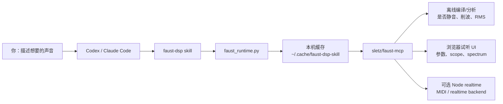
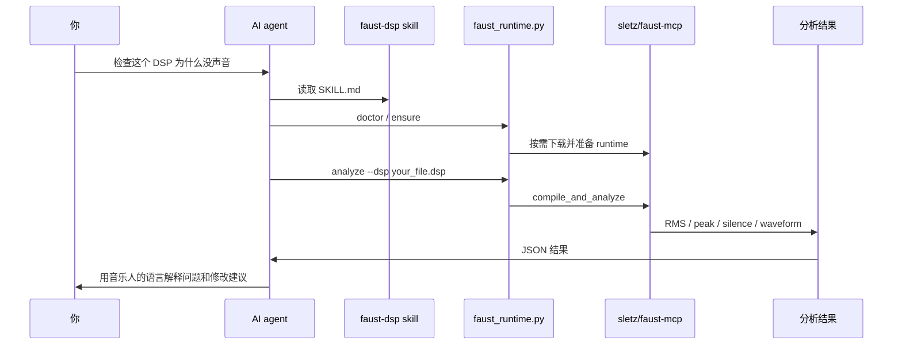
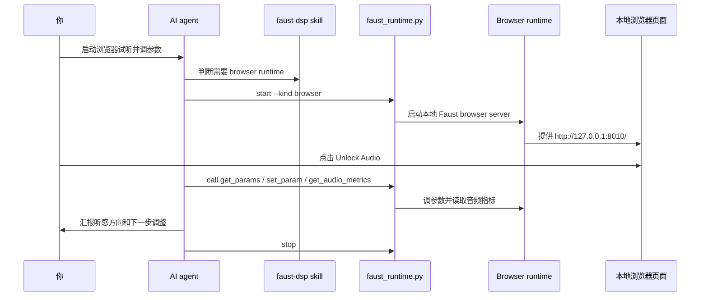

# Faust DSP Skill

让 Codex、Claude Code 或其他支持 skill 的 AI agent 帮你写、检查、试听和调试
[Faust](https://faust.grame.fr/) DSP 音频程序。

> 本项目基于 [sletz/faust-mcp](https://github.com/sletz/faust-mcp) 的 runtime
> 设计和工具接口改写而来。感谢 `sletz/faust-mcp` 原作者和 Faust 社区提供的
> MCP server、浏览器 runtime、Node realtime runtime 和离线分析思路。本项目做的事情是：
> 把这些能力包装成更适合 Codex、Claude Code 等 AI agent 使用的 skill。

如果你是音乐人、声音设计师、电子乐玩家，暂时不懂 MCP、Python、Node.js 这些词也没关系。这个项目的目标是：你只管描述声音，AI 尽量帮你把本地 Faust 测试环境装好、启动好、用完关掉。

## 先确认你适合现在安装

这个项目不是 VST/AU 插件，也不是一个独立的音乐软件。它是给 AI agent 用的 skill。

在安装前，你至少需要：

1. 已经安装并能打开 **Codex** 或 **Claude Code**。
2. 知道怎样在 Codex / Claude Code 里输入一句任务，例如“帮我检查这个项目”。
3. 知道当 AI 请求运行终端命令时，如何同意或拒绝。
4. 能打开终端复制粘贴几行命令。

如果你还没有用过 Codex 或 Claude Code，建议先熟悉它们的基本操作，再回来安装这个 skill。这个 README 会尽量友好，但不会从“什么是终端”开始讲。

## 这个 skill 能帮你做什么

你可以对 AI 说：

```text
Use $faust-dsp to write a simple warm pad synth in Faust and check whether it outputs sound.
```

或者中文也可以：

```text
用 $faust-dsp 帮我检查这个 Faust 合成器为什么没声音，并修好。
```

安装后，AI 可以帮你：

- 写 Faust `.dsp` 合成器或效果器。
- 检查 Faust 代码有没有语法错误。
- 分析声音是否静音、爆音、削波。
- 启动本地浏览器试听界面。
- 调参数、读取音频电平、查看 scope/spectrum/probe 数据。
- 自动安装和启动底层 runtime，尽量不让你手动配置 MCP server。

## 你需要理解的最小心智模型

你不需要手动安装 MCP server。你只需要安装这个 skill。



可以把它想成三层：

1. **你和 AI 对话**：你描述声音、粘贴 Faust 代码、提出修改要求。
2. **skill 教 AI 怎么做**：AI 读取 `SKILL.md`，知道应该调用哪些脚本、如何解释结果。
3. **本地 runtime 真正干活**：`sletz/faust-mcp` 负责实际编译、分析、播放或暴露参数。

## 安装：Codex 推荐流程

### 1. 下载这个项目

打开终端，运行：

```bash
git clone https://github.com/pingp76/faust-dsp-skill.git
cd faust-dsp-skill
```

### 2. 安装 skill

```bash
mkdir -p ~/.codex/skills
cp -R skill/faust-dsp ~/.codex/skills/
```

### 3. 重启 Codex

重启后，Codex 才会重新扫描 skills。之后你就可以在对话里使用：

```text
$faust-dsp
```

## 安装：Claude Code 和其他支持 skill 的 agent

把这个目录复制到你的 agent 能读取 skills 的位置：

```text
skill/faust-dsp
```

这个目录里面有标准的 skill 结构：

```text
faust-dsp/
├── SKILL.md
├── scripts/
├── references/
└── assets/
```

Claude Code 的插件项目通常会把 skill 放在类似 `skills/faust-dsp/` 的目录里。其他 agent 的安装位置可能不同，请按那个工具自己的 skill 搜索路径放置。

## 第一次运行验证

安装完 skill 后，建议先跑一个“小而完整”的验证流程。不要一上来就让 AI 写复杂合成器，先确认它能找到 skill、运行脚本、检查环境。

在 Codex 或 Claude Code 里输入：

```text
Use $faust-dsp. This is my first run. Run doctor, explain what each line means, then analyze the bundled oscillator example. If anything is missing, tell me the simplest next step. Stop any runtime you start.
```

如果你想用中文：

```text
用 $faust-dsp 做第一次安装验证：先运行 doctor，解释每一项结果；然后分析自带的 oscillator 示例。如果缺少软件，告诉我最简单的下一步。你启动的 runtime 用完要关闭。
```

### 第一次运行时你可能会看到什么

第一次运行比以后慢，这是正常的。你可能会看到 AI 执行类似这些动作：

1. 运行 `python3 .../faust_runtime.py doctor`。
2. 输出一段 JSON，里面可能有 `git`、`python`、`faust`、`g++`、`node` 等字段。
3. 如果需要真正分析或试听，AI 可能会请求联网下载 `sletz/faust-mcp`。
4. 它会把下载的 runtime 放到 `~/.cache/faust-dsp-skill/`。
5. 它可能会安装 Python 依赖，第一次要等一会儿。
6. 如果你要求浏览器试听，它还可能安装 browser UI / Node 相关依赖；这一步像普通软件第一次启动前的准备，可能要等几十秒到几分钟。
7. 它可能会启动本地网页，例如 `http://127.0.0.1:8010/`。这是你电脑上的本地服务，不是把声音上传到云端。
8. 浏览器可能要求你点一下 `Unlock Audio` 或输出开关，这是浏览器的安全限制。

### 成功时大概是什么样子

离线分析成功时，AI 通常能看到并解释类似这些结果：

```text
status: success
max_amplitude: ...
rms: ...
is_silent: false
num_outputs: 2
```

你不需要理解每个数字。最重要的是：

- `status: success`：Faust 编译和分析成功。
- `is_silent: false`：不是完全静音。
- `max_amplitude` 很大：可能有削波风险。
- `rms` 很小或 `is_silent: true`：可能没声音、增益太低、门限没打开，或缺少输入。

### 如果第一次验证失败

不要急着删项目。把错误原文发给 AI，并说：

```text
Use $faust-dsp to explain this first-run error and give me the simplest fix.
```

最常见的是缺少 Faust CLI、C++ 编译器，或首次联网下载被系统拦住。

## 工作流程图

### 离线分析流程



### 浏览器试听流程



## 更多使用例子

### 例子 1：检查一个没声音的合成器

```text
Use $faust-dsp to inspect my file broken_synth.dsp. First run offline analysis. If it is silent, explain the likely musical reason, patch the DSP, then analyze again.
```

适合场景：

- oscillator 写了但没有输出。
- envelope gate 没打开。
- gain 是 0。
- stereo 输出接错。

### 例子 2：把声音描述变成 Faust 原型

```text
Use $faust-dsp to create a Faust prototype for a dark ambient drone: two slow detuned oscillators, gentle saturation, lowpass movement, and a wet reverb-like tail. Analyze it for clipping and silence.
```

AI 应该先写 `.dsp`，再用离线分析检查是否有声、是否过载。

### 例子 3：做一个可调参数的浏览器试听版本

```text
Use $faust-dsp to make a small playable synth with controls for cutoff, resonance, drive, and output gain. Start the browser runtime so I can audition it, then tell me which URL to open.
```

你可能会看到浏览器打开本地页面。第一次需要等 Python、browser UI 或 Node 依赖安装，并可能需要点击 `Unlock Audio`。

### 例子 4：调试效果器对输入音频的反应

```text
Use $faust-dsp to build a Faust distortion/filter effect that can process an input signal. Use a sine or noise test input first, analyze RMS and clipping, then suggest safer default gain values.
```

适合写效果器，而不是纯合成器。AI 应该注意 input/output 数量、增益和削波。

### 例子 5：做几个版本并比较

```text
Use $faust-dsp to create three variations of a metallic percussion synth. Analyze each one, compare loudness and clipping risk, then recommend the most stable version for further design.
```

适合声音设计探索。AI 可以生成多个 `.dsp` 文件，分别跑分析，再用结果筛选。

## 手动命令参考

这些命令主要给 AI 或稍微懂终端的用户使用。平时你可以直接让 AI 运行。

检查环境：

```bash
python3 scripts/faust_runtime.py doctor
```

安装/准备底层 runtime：

```bash
python3 scripts/faust_runtime.py ensure
```

分析一个 Faust 文件是否有声音：

```bash
python3 scripts/faust_runtime.py analyze --dsp assets/examples/oscillator.dsp
```

启动浏览器试听 runtime：

```bash
python3 scripts/faust_runtime.py start --kind browser
```

查看 runtime 是否还在运行：

```bash
python3 scripts/faust_runtime.py status
```

关闭 skill 启动的 runtime：

```bash
python3 scripts/faust_runtime.py stop
```

## 你可能需要安装的基础软件

最简单的离线分析通常需要：

- Git：用来下载底层 runtime。
- Python 3：用来运行管理脚本。
- Faust CLI：真正编译 Faust DSP。
- C++ 编译器：离线分析时使用。

如果你用 macOS，通常会需要：

```bash
xcode-select --install
```

如果你用 Homebrew，可以尝试：

```bash
brew install git python faust
```

如果这些你不熟，不要紧。你可以直接把报错贴给 AI，让它用 `$faust-dsp` 帮你解释下一步。

## 常见问题

### 我必须懂 MCP 吗？

不需要。

这个 skill 背后会使用来自 `sletz/faust-mcp` 的本地 runtime，但你不需要自己配置 MCP server。AI 会通过脚本自动安装、启动和调用。

### 我必须会写 Faust 吗？

不必须，但你至少要知道自己想要什么声音。比如“更暗”“少一点爆音”“需要 cutoff 控制”“想要双声道输出”。AI 可以帮你写第一版 Faust，再用本 skill 验证。

### 这是不是 VST/AU 插件？

不是。它是给 AI agent 用的 skill。它帮助 AI 写和测试 Faust DSP。你之后可以再把 Faust 代码导出到其他音频插件或工程里。

### 会不会一直开着后台服务？

设计上不会。`faust_runtime.py` 会记录自己启动的进程，并提供：

```bash
python3 scripts/faust_runtime.py stop
```

来关闭它们。AI 使用这个 skill 时，也应该在任务结束前关闭自己启动的 runtime。

### 为什么不直接把 faust-mcp 放进这个仓库？

因为本项目创建时，上游 `sletz/faust-mcp` 没有明确的 license 文件。为了尊重上游版权，这里不直接复制上游源码，而是在用户本机按需下载。

## 项目来源

这个 skill 是基于
[sletz/faust-mcp](https://github.com/sletz/faust-mcp)
的 runtime 设计和工具接口改写出来的。

`sletz/faust-mcp` 提供了 Faust MCP server、浏览器 runtime、Node realtime runtime、离线分析等核心实现。本项目提供的是更适合 AI skill 使用的说明、脚本包装、安装流程和面向 agent 的工作方式。

再次感谢 `sletz/faust-mcp` 原作者和 Faust 生态。

## License

本仓库中的 wrapper 脚本和文档使用 MIT License。

MIT License 不自动覆盖运行时下载的上游 `sletz/faust-mcp` 代码。上游代码的使用应以它自己的授权状态为准。
